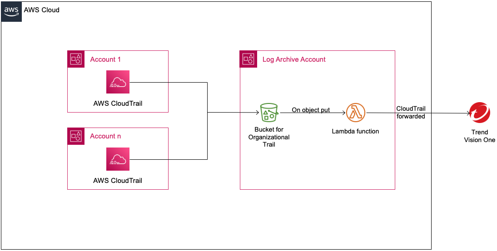

# Add AWS Account to Cloud One and Enable CloudTrail Analyzes

To fully integrate an AWS account in Cloud One, you must deploy resources in your AWS account and do manual steps in Trend Cloud One dashboard. This CloudFormation template automates all these steps on your behalf, including enabling the CloudTrail integration and connecting it to your Vision One tenant. Once it's working, you will start to receive alerts on any CloudTrail events that trigger a detection model in the Workbench App in Vision One - (XDR Threat Investigation > Workbench). This helps your organization to quickly detect suspicious malicious behavior on their AWS account and enable its Security and Cloud Operation teams to respond quickly to security events.

## CloudTrail Integration Architecture



## What does it actually do?

1. A Custom Resource gets the Cloud One Account ID and Cloud One Region.
2. A Custom Resource completes the integration between the Cloud One and Vision One accounts.
3. All the required IAM resources for Workload Security is created.
4. A Custom Resource completes the integration between the AWS and Workload Security accounts.
5. The default Cloud One CloudFormation stack is deployed.
6. A Custom Resource completes the integration between the AWS and Cloud One accounts.
7. A Custom Resource gets from Cloud One backend the Token for CloudTrail integration.
8. The default CloudTrail CloudFormation stack is deployed.

## Requirements

- Have an API Key for a [Cloud One](https://www.trendmicro.com/cloudone) account. Click [here](https://cloudone.trendmicro.com/docs/identity-and-account-management/c1-api-key/#new-api-key) for a guide on how to generate an API Key.
- An AWS Account with Admin permissions
- Generate a Vision One Enrollment Token. See step #1 in [this documentation](https://docs.trendmicro.com/en-us/enterprise/trend-micro-xdr-help/ConfiguringCloudOneWorkloadSecurity).

## Limitations

- Your Stack name must be up 8 characters long or shorter. I recommend `CloudOne`.
- You must deploy the stack to the following region based on your Cloud One account region:

| Cloud One Region  | AWS Region      |
| ----------------- | --------------- |
| us-1              | us-east-1       |
| in-1              | ap-south-1      |
| gb-1              | eu-west-2       |
| au-1              | ap-southeast-2  |
| de-1              | eu-central-1    |
| jp-1              | ap-northeast-1  |
| sg-1              | ap-southeast-1  |
| ca-1              | ca-central-1    |

## Parameters

### Required

- CloudOneApiKey
  - Description: Cloud One API Key. See Requirements above for more details.
- VisionOneServiceToken
  - Description: Vision One Service Token. See Requirements above for more details.
- CreateNewTrail:
  - Description: Decides if a new Trail should be created. Defaults to False, so you must enter a S3 Bucket name in the ExistingCloudtrailBucketName parameter. In case you pick True, a new trail and bucket will be created for you. Setting this to True will incur in extra costs.
- ExistingCloudtrailBucketName:
  - Description: Specify the name of an existing bucket that you want to use for forwarding to Trend Micro Cloud One. Only used if CreateNewTrail is set to False.

### Shouldn't be Changed from Default

These are going to be changed in case you decide to host the templates yourself. `QSS3BucketName` should be the bucket name that you host these templates from and `QSS3KeyPrefix` would be the key prefix/path of the root "folder" for these templates. Example: If the files are hosted in the bucket named `my-bucket` and inside the folder `trendmicro/onboarding`, `QSS3BucketName` value should be `my-bucket` and `QSS3KeyPrefix` value should be `trendmicro/onboarding`.

- QSS3BucketName:
  - Default: cloudone-community
  - Description: S3 bucket name for the deployment assets. Deployment bucket name
    can include numbers, lowercase letters, uppercase letters, and hyphens (-).
- QSS3KeyPrefix:
  - Default: ""
  - Description: S3 key prefix for the Deployment assets. Deployment key prefix can include numbers, lowercase letters uppercase letters, hyphens (-), dots(.) and forward slash (/).

## Deployment

### Via CLI

You can run the following:

```bash
#!/bin/bash
export BUCKET="your-cloudtrail-bucket"
export APIKEY="your-cloudone-apikey"
export TOKEN="your-visionone-enrollment-token"
aws cloudformation create-stack --stack-name common-onboard-test --template-url https://aws-abi.s3.us-east-1.amazonaws.com/latest/cfn-abi-trend-cloudone/templates/trend-cloudone-onboard/main.template.yaml --capabilities CAPABILITY_NAMED_IAM CAPABILITY_AUTO_EXPAND --parameters ParameterKey=ExistingCloudtrailBucketName,ParameterValue=$BUCKET ParameterKey=CloudOneApiKey,ParameterValue=$APIKEY ParameterKey=VisionOneServiceToken,ParameterValue=$TOKEN ParameterKey=QSS3KeyPrefix,ParameterValue=$HASH/
```

## Removal or Deployment Failure

If one decides to remove this stack, or if it fails during deployment, all modifications made by it, including any kind of account integration, will be reverted back to its pre-deployment state.

---

## What AWS Permissions are used

### The different Lambda Functions triggered as Custom Resources requires the following permissions

- secretsmanager:GetSecretValue (specific to the secrets created as part of this stack)
- kms:Decrypt (specific to the key created as part of this stack)
- Managed Policy: AWSLambdaBasicExecutionRole

### Product required resources

- Please check the [product documentation](https://cloudone.trendmicro.com/docs/) as they can get updated over time.

---

## To deploy this stack, the user would need the following permissions

### Permissions to create, update, delete, and describe CloudFormation stacks

- cloudformation:CreateStack
- cloudformation:UpdateStack
- cloudformation:DeleteStack
- cloudformation:DescribeStacks

### Permissions to create, update and get the configuration of the Lambda function

- lambda:CreateFunction
- lambda:UpdateFunctionCode
- lambda:GetFunctionConfiguration

### Permissions to create the IAM role for the Lambda function and to attach and detach the policy to the role

- iam:ListAccountAliases
- iam:CreateRole
- iam:DeleteRole
- iam:CreatePolicy
- iam:PassRole
- iam:AttachRolePolicy
- iam:DetachRolePolicy
- iam:DeleteRolePolicy
- iam:PutRolePolicy
- iam:GetRole
- iam:GetRolePolicy

### Permissions to create a CloudWatch Logs group and stream and to write logs from the Lambda function to CloudWatch Logs

- logs:CreateLogGroup
- logs:CreateLogStream
- logs:PutLogEvents

### Permissions to download the code from an S3 bucket

- s3:GetObject
- s3:GetBucketLocation

### Permissions to create and trigger the Custom Resources:

- lambda:InvokeFunction
- lambda:CreateFunction
- lambda:DeleteFunction
- lambda:GetFunction
- lambda:GetFunctionConfiguration
- lambda:AddPermission
- lambda:RemovePermission
- lambda:UpdateFunctionCode
- lambda:UpdateFunctionConfiguration
- lambda:InvokeFunction
