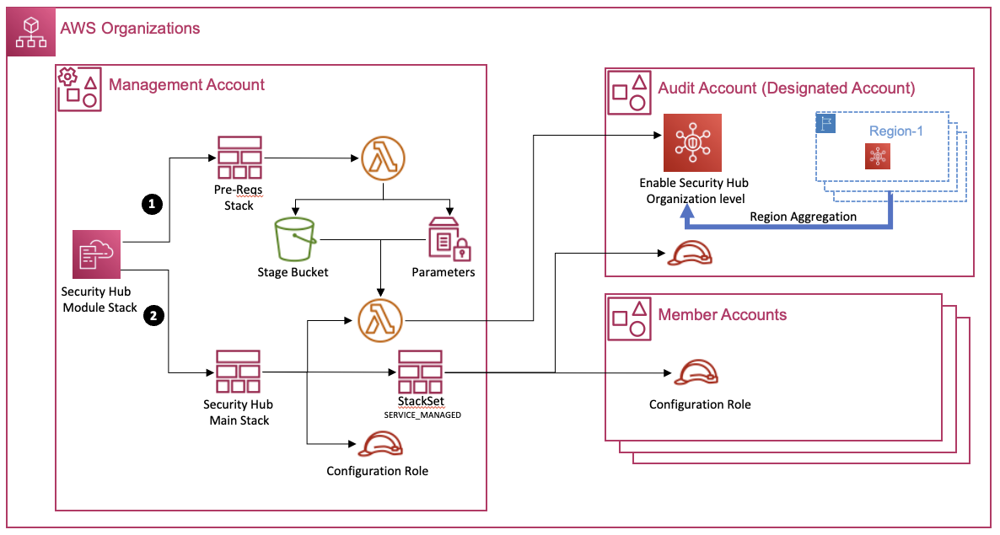

# Integrate Cloud One with AWS SecurityHub

Security Hub collects security data from across AWS accounts, services, and supported third-party partner products and helps you analyze your security trends and identify the highest priority security issues. By integrating the Trend Cloud One, you can leverage the consolidates of your security findings of your containers inside SecurityHub.

## SecurityHub Integration Architecture



## What does it actually do?

This solution will integrate Trend Cloud One security findings with SecurityHub across all default enabled regions.

1. It deploys a Lambda function that 
1. Deploys all the required IAM resources for the lambda function is created.
2. A Custom Resource completes the integration by running a Lambda function.
3. The default CloudTrail CloudFormation stack is deployed.


## Requirements

- Have an API Key for a [Cloud One](https://www.trendmicro.com/cloudone) account. Click [here](https://cloudone.trendmicro.com/docs/identity-and-account-management/c1-api-key/#new-api-key) for a guide on how to generate an API Key.
- An AWS Account with Admin permissions


## Limitations

- Your Stack name must be up 8 characters long or shorter. I recommend `CloudOne`.
- You must deploy the stack to the following region based on your Cloud One account region:

| Cloud One Region  | AWS Region      |
| ----------------- | --------------- |
| us-1              | us-east-1       |
| in-1              | ap-south-1      |
| gb-1              | eu-west-2       |
| au-1              | ap-southeast-2  |
| de-1              | eu-central-1    |
| jp-1              | ap-northeast-1  |
| sg-1              | ap-southeast-1  |
| ca-1              | ca-central-1    |

## Parameters

### Required

- CloudOneApiKey
  - Description: Cloud One API Key. See Requirements above for more details.
- EnableSecurityHubIntegration
  - Description: Enable SecurityHub Integration. If set to `true`, the integration will be enabled. If set to `false`, the integration will expect that you have done this already.
  - Default: false


### Shouldn't be Changed from Default

These are going to be changed in case you decide to host the templates yourself. `QSS3BucketName` should be the bucket name that you host these templates from and `QSS3KeyPrefix` would be the key prefix/path of the root "folder" for these templates. Example: If the files are hosted in the bucket named `my-bucket` and inside the folder `trend-cloudone-securityhub`, `QSS3BucketName` value should be `my-bucket` and `QSS3KeyPrefix` value should be `trend-cloudone-securityhub`.

- QSS3BucketName:
  - Default: cloudone-community
  - Description: S3 bucket name for the deployment assets. Deployment bucket name
    can include numbers, lowercase letters, uppercase letters, and hyphens (-).
- QSS3KeyPrefix:
  - Default: ""
  - Description: S3 key prefix for the Deployment assets. Deployment key prefix can include numbers, lowercase letters uppercase letters, hyphens (-), dots(.) and forward slash (/).

## Deployment

## To deploy this stack, the user would need the following permissions:

### Permission to get secret from the secret manager.
- secretsmanager:GetSecretValue
### Permission to use a kms key to decrypt the secret from secret manager.
- kms:Decrypt
### Permission to enable, disable and list product and findings in SecurityHub
- securityhub:ListEnabledProductsForImport
- securityhub:EnableImportFindingsForProduct
- securityhub:DisableImportFindingsForProduct
#### Permissions to create, update, delete, and describe CloudFormation stacks.
- cloudformation:CreateStack
- cloudformation:UpdateStack
- cloudformation:DeleteStack
- cloudformation:DescribeStacks
#### Permissions to create, update, delete, and describe CloudFormation StacksSets, StackInstances.
- cloudformation:CreateStackSet
- cloudformation:CreateStackInstances
- cloudformation:DescribeStackSet
- cloudformation:UpdateStackSet
- cloudformation:UpdateStackInstances
- cloudformation:DeleteStackSet
- cloudformation:DeleteStackInstances
- cloudformation:ListStackInstances
#### Permissions to retrieve all Organizational Unit (OU) IDs in the organization.
- organizations:ListRoots
- organizations:ListOrganizationalUnitsForParent
#### Permissions to create, update and get the configuration of the Lambda function.
- lambda:GetFunctionConfiguration
- lambda:UpdateFunctionCode
- lambda:UpdateFunctionConfiguration
- lambda:CreateAlias
- lambda:CreateFunction
#### Permissions to create a CloudWatch Logs group and stream and to write logs from the Lambda function to CloudWatch Logs.
- logs:CreateLogGroup
- logs:CreateLogStream
- logs:PutLogEvents 
#### Permission to download the code from an S3 bucket.
- s3:GetObject

### Via Dashboard

[](https://console.aws.amazon.com/cloudformation/home#/stacks/new?stackName=CloudOne-SSM&templateURL=https://immersionday-workshops-trendmicro.s3.amazonaws.com/abi/main.template.yaml)

### Via CLI

You can run the following:

```bash
#!/bin/bash
export STACK_NAME=ABI-TM-SECHUB
export TEMPLATE_URL=https://immersionday-workshops-trendmicro.s3.amazonaws.com/abi/main.template.yaml
export CLOUDONE_API_KEY=<cloudone-api-key>
export CLOUDONE_REGION_ENDPOINT=<cloudone-ws-region-endpoint>
export DEPLOYSECURITYHUBINTEGRATION=<true|false>
aws cloudformation create-stack \
    --stack-name $STACK_NAME \
    --template-url $TEMPLATE_URL \
    --parameters ParameterKey=CloudOneAPIKey,ParameterValue=$CLOUDONE_API_KEY \
                 ParameterKey=CloudOneRegionEndpoint,ParameterValue=$CLOUDONE_REGION_ENDPOINT \
                 ParameterKey=DeploySecurityHubIntegration,ParameterValue=$DEPLOYSECURITYHUBINTEGRATION \
                 ParameterKey=EnableSecurityHub,ParameterValue=$DEPLOYSECURITYHUBINTEGRATION \
    --capabilities CAPABILITY_NAMED_IAM
```

## Removal or Deployment Failure

If one decides to remove this stack, or if it fails during deployment, all modifications made by it, including any kind of account integration, will be reverted back to its pre-deployment state.
