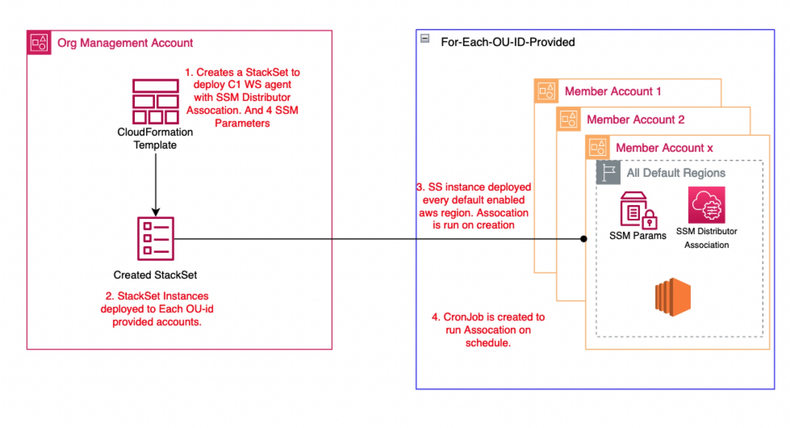

# AWS Organizations Trend Cloud One Workload Security SSM Automation
---

Distributor is a feature integrated with AWS Systems Manager that you can use to securely store and distribute software packages in your accounts. 
By integrating Workload Security with AWS Systems Manager Distributor, you can distribute Cloud One Workload Security agents across multiple platforms, control access to managed instances, and automate your deployments.


## AWS Systems Manager Integration Architecture



## What this solution does.

This solution will distribute the Workload Security agent across OU member accounts across all default enabled regions.

1. This stack is deployed in the Organizational management account as a CloudFormation template.
2. A Custom Resource gets the Cloud One Workload Agent Activation URL, Manager URL, Tenant ID and Token.
3. A Custom Resource gets all OU ID's in an AWS Organization.
4. On deployment, a StackSet will be created in every AWS Account from the provided OU-IDs, and agent parameters.
5. Four parameters will be created in AWS Systems Manager Parameter Store in each AWS region.
6. A Systems Manager Association will run on creation(CRON as well) that will deploy the Workload Security Agent on every['*'] instance.

---

## Requirements

Have a valid API Key for a [Cloud One](https://www.trendmicro.com/cloudone) account. Click [here](https://cloudone.trendmicro.com/docs/identity-and-account-management/c1-api-key/#new-api-key) for a guide on how to generate an API Key.

---

## How to Deploy with UI

To deploy the solution, launch this CloudFormation template in your organization’s management account.

[](https://console.aws.amazon.com/cloudformation/home#/stacks/new?stackName=CloudOne-SSM&templateURL=https://immersionday-workshops-trendmicro.s3.amazonaws.com/abi/main.template.yaml)

---

### Provide the following inputs for the template parameters:

#### **AccountAdminStatus**
  - Stack Name: Enter a name for the Stack.
  - AccountAdminStatus: Specify if the solution will use a delegated administrator account within the Organization to manage the software packages. CloudFormation StackSet IAM roles should be provisioned beforehand.

#### **Targets**
  - CronJob: Specify the CRON Job for future scheduling. 
    - [Default is everyday @10:15AM - cron(15 10 * * ? *)] [see here](https://docs.aws.amazon.com/lambda/latest/dg/services-cloudwatchevents-expressions.html)

#### **Cloud One Workload Security**
  - **CloudOneAPIKey**: Have an API Key for a [Cloud One](https://www.trendmicro.com/cloudone) account. Click [here](https://cloudone.trendmicro.com/docs/identity-and-account-management/c1-api-key/#new-api-key) for a guide on how to generate an API Key.
  
  - Cloud One Account Region.


---

## How to Deploy with CLI

```bash
#!/bin/bash
export STACK_NAME=ABI-TM-SSM
export TEMPLATE_URL=https://immersionday-workshops-trendmicro.s3.amazonaws.com/abi/main.template.yaml
export CLOUDONE_API_KEY=<cloudone-api-key>
export CLOUDONE_REGION_ENDPOINT=<cloudone-ws-region-endpoint>
export ACCOUNT_ADMIN_STATUS=<SELF|DELEGATED_ADMIN>
export CRON_JOB="cron(15 10 * * ? *)"
aws cloudformation create-stack \
    --stack-name $STACK_NAME \
    --template-url $TEMPLATE_URL \
    --parameters ParameterKey=CloudOneAPIKey,ParameterValue=$CLOUDONE_API_KEY \
                 ParameterKey=CloudOneRegionEndpoint,ParameterValue=$CLOUDONE_REGION_ENDPOINT \
                 ParameterKey=AccountAdminStatus,ParameterValue=$ACCOUNT_ADMIN_STATUS \
                 ParameterKey=CronJob,ParameterValue="$CRON_JOB" \
    --capabilities CAPABILITY_NAMED_IAM
```

---

## Limitations
---
1. EC2 instances must have the SSM agent installed. Click the link for [supported SSM OS platforms](https://docs.aws.amazon.com/systems-manager/latest/userguide/prereqs-operating-systems.html).
2. EC2 instances must have the required SSM permissions. Click the link for [setup configuration](https://docs.aws.amazon.com/systems-manager/latest/userguide/setup-instance-permissions.html).
3. StackSets doesn't deploy stack instances to the organization management account, even if the organization management account is in your organization or in an OU in your organization. See here for [DeploymentTargets](https://docs.aws.amazon.com/AWSCloudFormation/latest/APIReference/API_DeploymentTargets.html).


---
## What AWS Permissions are used.

#### The Lambda Uses the following:
- secretsmanager:GetSecretValue
- organizations:ListOrganizationalUnitsForParent
- organizations:ListRoots
- logs:CreateLogGroup
- logs:CreateLogStream
- logs:PutLogEvents

---

## To deploy this stack, the user would need the following permissions:

#### Permissions to create, update, delete, and describe CloudFormation stacks.
- cloudformation:CreateStack
- cloudformation:UpdateStack
- cloudformation:DeleteStack
- cloudformation:DescribeStacks
#### Permissions to create, update, delete, and describe CloudFormation StacksSets, StackInstances.
- cloudformation:CreateStackSet
- cloudformation:CreateStackInstances
- cloudformation:DescribeStackSet
- cloudformation:UpdateStackSet
- cloudformation:UpdateStackInstances
- cloudformation:DeleteStackSet
- cloudformation:DeleteStackInstances
- cloudformation:ListStackInstances
#### Permissions to retrieve all Organizational Unit (OU) IDs in the organization.
- organizations:ListRoots
- organizations:ListOrganizationalUnitsForParent
#### Permissions to create, update and get the configuration of the Lambda function.
- lambda:CreateFunction
- lambda:UpdateFunctionCode
- lambda:GetFunctionConfiguration
#### Permissions to create the IAM role for the Lambda function and to attach and detach the policy to the role.
- iam:CreateRole
- iam:CreatePolicy
- iam:AttachRolePolicy
- iam:DeleteRolePolicy
#### Permissions to create a CloudWatch Logs group and stream and to write logs from the Lambda function to CloudWatch Logs.
- logs:CreateLogGroup
- logs:CreateLogStream
- logs:PutLogEvents 
#### Permission to download the code from an S3 bucket.
- s3:GetObject
